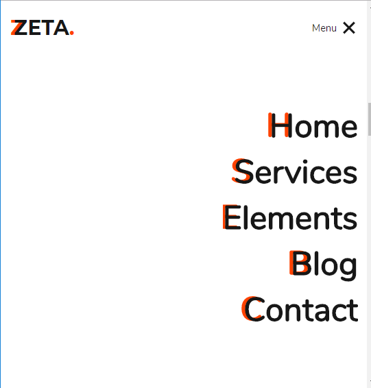

# laravel-docker-react

This project provides a Docker-based setup for a Laravel application using PHP 7.4 with Apache. It includes the necessary configurations to run a Laravel application and manage its dependencies effectively.

## Features

- **PHP 7.4 and Apache**: Built on a recent PHP version with the Apache web server.
- **Composer**: PHP dependency manager to handle Laravel and other PHP package installations.
- **Node.js Support**: Includes Node.js for managing front-end assets.
- **PostgreSQL and MySQL Support**: Configured with PDO extensions for both MySQL and PostgreSQL databases.
- **Automatic Laravel Key Generation**: Generates the application key during the build process.
- **Asset Compilation**: Built front-end assets using npm.

## Prerequisites

Before you begin, ensure you have the following installed:

- [Docker](https://www.docker.com/get-started)
- [Docker Compose](https://docs.docker.com/compose/)

## Getting Started

Follow these steps to set up and run the Laravel application using Docker.

### Clone the Repository

```bash
git clone <repository-url>
cd <repository-directory>
```


### Build and run the Docker Image
```bash
docker build -t laravel-app .
docker run -d -p 8080:80 --name laravel-app laravel-app
```
### Example images : 




